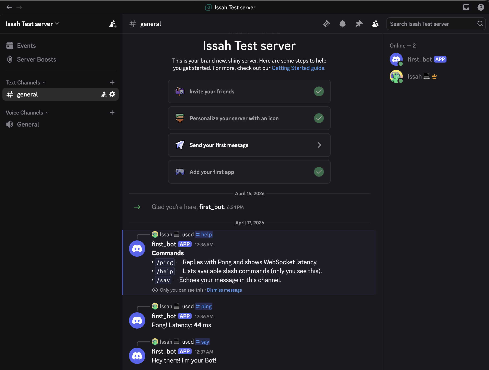

# Discord bot (Bun + TypeScript + discord.js v14)

## Purpose

This is a **simple, Node.js-compatible Discord bot** built with **[Bun](https://bun.sh)**, **TypeScript**, and **discord.js v14**. It demonstrates **clean slash-command and event handlers**, separation of concerns, and patterns that carry over to other chat platforms (Telegram, Zoho Cliq, WhatsApp bots, and similar): register commands or webhooks, route events, handle errors, and keep modules small and focused. It works well as a **portfolio example** and as something you can walk through in technical discussions.

## Features

- **Bun** for installs, scripts, and fast `.ts` execution (including `--watch` for development).
- **discord.js v14** with `GatewayIntentBits.Guilds` (enough for slash commands in servers).
- **Dynamic loading** of command and event modules from `src/commands` and `src/events`.
- **`deploy-commands`** script registers slash commands **globally** or to a **test guild** via `GUILD_ID`.
- **dotenv** for `BOT_TOKEN`, `CLIENT_ID`, and optional `GUILD_ID`.
- **Biome** for formatting and linting (replaces ESLint + Prettier).
- **Structured logging** with simple ANSI colors (no extra runtime dependency).

## Prerequisites

- [Bun](https://bun.sh) installed.
- A [Discord application](https://discord.com/developers/applications) with a bot user, token, and **Application ID**.
- Bot invited to your server with the **`applications.commands`** scope (and **`bot`** if you need gateway features beyond pure interactions—this template uses the gateway for slash commands).

## Setup

1. **Install dependencies**

   ```bash
   bun install
   ```

2. **Configure environment**

   ```bash
   cp .env.example .env
   ```

   Edit `.env`:

   - **`BOT_TOKEN`** — Bot token from the Developer Portal → **Bot**.
   - **`CLIENT_ID`** — Application ID from **General Information**.
   - **`GUILD_ID`** (optional) — Your server ID. If set, slash commands are registered **only to this guild** (updates appear quickly). If empty, commands are registered **globally** (can take up to about an hour to propagate).

3. **Register slash commands**

   ```bash
   bun run deploy-commands
   ```

4. **Run the bot**

   ```bash
   bun dev
   ```

   For a production-style run after bundling:

   ```bash
   bun run build
   bun start
   ```

## Biome (lint + format)

- Check: `bun run biome:check` (same as `bun run lint`)
- Auto-fix: `bun run biome:fix`
- Format only: `bun run format`

## Project structure

```text
.
├── scripts/
│   └── deploy-commands.ts   # REST registration (guild vs global)
├── src/
│   ├── commands/            # Slash command modules (default export)
│   ├── events/              # Gateway event modules (default export)
│   ├── handlers/            # Loaders + interaction dispatch
│   ├── types/               # Shared types + discord.js Client augmentation
│   ├── utils/               # Logger and small helpers
│   └── index.ts             # Entry: client, load commands/events, login
├── .env.example
├── biome.json
├── package.json
└── tsconfig.json
```

### Adding a slash command

1. Create `src/commands/mycommand.ts` that **default-exports** `{ data, execute }` (see `ping.ts`).
2. Run `bun run deploy-commands` again so Discord knows the new definition.
3. Restart or rely on `bun dev` watch if only handler code changed (definitions always need deploy).

### Adding an event

1. Add `src/events/myevent.ts` with **default export** `{ name, once?, execute }` (see `ready.ts`).
2. Restart the bot (or let watch reload).

## Example commands

| Command   | Description |
|-----------|-------------|
| `/ping`   | Replies with latency. |
| `/help`   | Lists loaded commands (ephemeral). |
| `/say`    | Repeats a required `message` string option. |

## What I learned / transferable skills

- **Slash commands vs runtime**: Definitions are pushed with **REST** (`deploy-commands`); the bot **handles** them on `interactionCreate`. Same split as registering webhooks vs processing payloads elsewhere.
- **Modular handlers**: One file per command/event keeps diffs small and onboarding easy.
- **Guild vs global registration**: Guild commands are ideal for fast iteration; global commands match production “works in every server” behavior.
- **Intents**: Only request what you need (`Guilds` here for slash commands in guilds).
- **Bun**: Very fast install and **TypeScript without a separate compile step** in dev—great for iterating on bot behavior before you `build` for deployment.

## Screenshots



Example: slash commands registered for the bot in a server (as seen in the Discord client).

## License

Released under the [MIT License](https://opensource.org/licenses/MIT).
